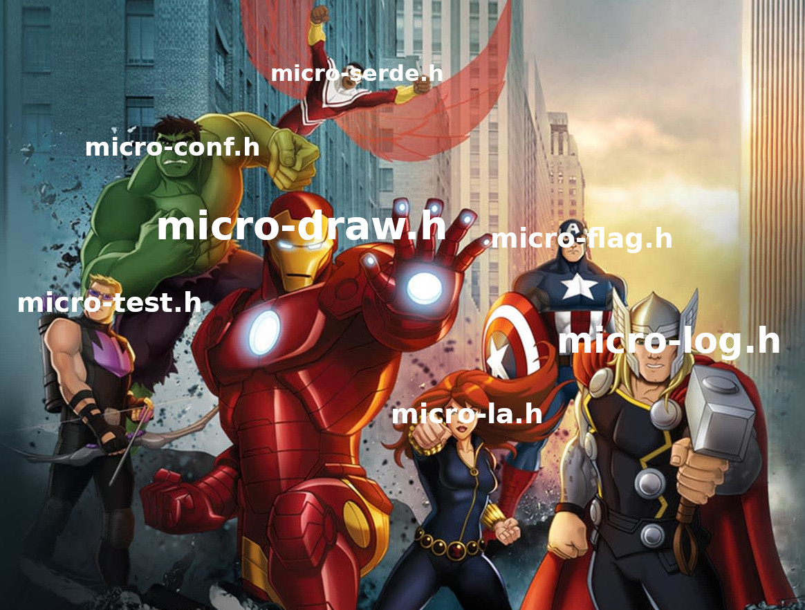

# micro-engine.h

Microheaders, assemble!

micro-engine is an header-only game engine. It is composed of several
independent headers from the beautiful
[microheaders](https://san7o.github.io/micro-headers/) collection.

Unlike my other game engine,
[Brenta-Engine](https://san7o.github.io/Brenta-Engine/), micro-engine
favors absolute simplicity over powerful but complex
features. micro-engine does not try to compete with Brenta because it
is designed following a different philosophy. It is written in C99,
graphics are software rendered with a focus on 2D, and it has no
dependencies other than X / Wayland for creating a window and alsa for
playing sound.

## Motivation

As Brenta grew in complexity, it naturally became more cumbersome to
quickly design and implement new features and applications. This is a
fundamental problem of all software, not a fault of my engine. Hence I
wanted to experiment with a simpler approach. I mean "simple" in its
most general form: in the abstraction, workflow and implementation.
