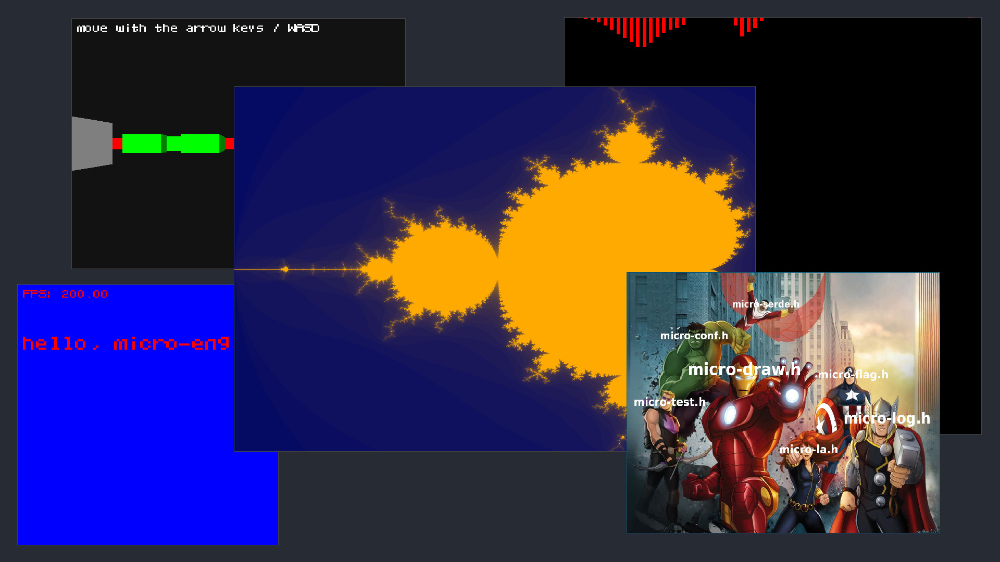

micro-engine is an header-only graphics engine. It is composed of
several independent headers from the beautiful
[microheaders](https://san7o.github.io/micro-headers/) collection.

Unlike my other graphics engine,
[Brenta-Engine](https://san7o.github.io/Brenta-Engine/), micro-engine
favors absolute simplicity over powerful but complex features. It is
written in C99, graphics are software rendered with a focus on 2D, and
it has no dependencies.

<h2 align=center>  Features </h2>

- deisgned for extreme portability
  - platform is abstracted in `micro-platform.h`, you need to
    implement just a few functions to port the engine. See
    [platforms](https://github.com/San7o/micro-engine.h/tree/main/include/micro-engine/platforms).
  - plug your custom memory allocator (`micro-arena.h` is used by
    default)
  - no dependencies (the core headers can be compiled without libc)
  - works everywhere C can compile to
  - easy to create bindings for other languages
- modularity: everything can be used as a stand-alone header-only
    library, meaning that you can use any part of the engine in your
    projects
- simplicity: you have a raw buffer where you can draw pixels to, the
  rest is in your control
- [microheaders](https://san7o.github.io/micro-headers/) included:
  - [micro-draw.h](https://github.com/San7o/micro-draw.h): rendering library
  - [micro-log.h](https://github.com/San7o/micro-log.h): logging library
  - [micro-la.h](https://github.com/San7o/micro-la.h): linear algebra, math functions and structures
  - [micro-arena.h](https://github.com/San7o/micro-arena.h): custom memory allocator
  - [micro-tests.h](https://github.com/San7o/micro-tests.h): testing framework
  - [micro-serde.h](https://github.com/San7o/micro-serde.h): serialization / deserialization
  - [micro-flag.h](https://github.com/San7o/micro-flag.h): parse command line arguments
  - [micro-module.h](https://github.com/San7o/micro-module.h): module / plugin / hot-reloading support
  - [micro-conf.h](https://github.com/San7o/micro-conf.h): config files parsing
  - [micro-bench.h](https://github.com/San7o/micro-bench.h): benchmarking library
  - [micro-hash.h](https://github.com/San7o/micro-hash.h): plenty of hash functions
  - [micro-fswatcher.h](https://github.com/San7o/micro-fswatcher.h): filesystem events
  - micro-fft.h: Fast Fourier Trasform implementation
  - micro-platform.h: platform abstraction
  - micro-app.h: event loop
  - [llist.h](https://github.com/San7o/llist.h): linked list implementation
  - [hashset.h](https://github.com/San7o/hashset.h)
  - [hashmap.h](https://github.com/San7o/hashmap.h)

<h2 align=center>  Screenshots </h2>

  

